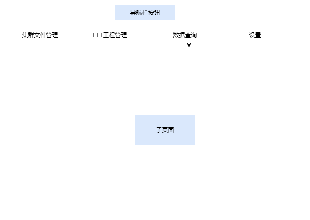

需要写的

- 一些参考连接

  

  摘要和关键词 https://wenku.baidu.com/view/5c4e291414791711cc79175b.html

  需求文档

  https://www.jianshu.com/p/cffbdffb72e4

- 摘要

  备注：摘要不超过400字，用简要精炼的语句表达**该设计的目的意义**、毕业设计的主**要所做的工作**，以及**作品的效果**。如果是公司的项目或者项目班的项目，重点说明自己的工作内容。

- 关键词

- 引言

  备注：主要内容为**本设计的目的意义**、**国内外与本设计相关的技术发展及产品发展的情况分析**、**本设计的市场调研分**析，**本设计涉及的先进技术简介**。

三、项目需求分析

要干什么，怎么设计

备注：本项内容注意以图文结合方式说明需求，如思维导图的形式或软件工程规范的需求分析图

四、项目设计

采用什么技术，怎么结合

备注：本项内容注意以图文结合方式说明项目设计，如符合软件工程规范的项目设计图

（可根据项目的实际进行拓展）

五、项目实现

（宋体小4号）

最终效果，代码截图

备注：本项内容注意以图文结合方式说明项目的实现，核心技术用流程图表达，关键界面截图，登录页面等不重要的页面不要截图

六、总 结


七、致谢 （用4号黑体）

××××××××××××××××××××（宋体小4号）

（以简炼的文字对指导教师和支持、协助完成论文（设计）的有关人员表示谢意。）

参考文献]（用4号黑体）


大数据离线分析平台

## 摘要

- 作品设计的意义

  发生了什么，所以有你这个出现

- 主要的工作

  使用什么xxx搭建什么,,

- 作品的效果

  可以解决什么

- 400字

大数据

随着计算机技术的不断的发展，产生的数据量越来越多，单机已经无法处理这样大量的数据。随后出现了 Hadoop的HDFS 用来存储海量数据，MapReduce，Spark，Flink计算引擎。使用MapReduce等进行计算时等需要使用特定语言来编写程序。 这对非专业人员来说学习成本较高，需要掌握对应的编程语言。本设计通过web界面的形式，让非开发人员通过简单的可视化操作对集群中的数据进行提取和并行计算。

本文阐述了基于Spark的离线大数据处理平台设计与实现，本平台采用web形式设计，使用Python web框架Django、Vue.js开发前后端 、Java编程封装核心的Spark处理程序。使用Apache Livy提交Spark任务到集群中。平台可以连接任意安装了Livy的Hadoop大数据集群，用户只需在平台Web端生成任务，提交到平台后，会调用集群上事先编写的Spark程序根据任务执行用户生成的操作，执行的结果可以在Web端实时查看。

本平台操作简单，用户只需在平台上通过可视化的操作方式，生成数据处理和分析任务。平台会自动将任务提交到集群上进行运行，在平台上可以实时查看任务运行状态和结果。

### 关键词

大数据；Spark；

### 引言

- 设计的目的意义
- 国内外与本设计相关的技术发展及产品发展的情况分析
- 本设计涉及的先进技术简介

随着现代信息技术的不断发展，移动互联网的普及，每天互联网都产生大量的信息，这些大量的数据中蕴含着很多由价值的信息。如何从大量的数据中进行统计分析成了个问题。因为单机内存等有限，在单机运行的传统分析工具如Excel等无法满足对大量数据的分析需求。随后出现了Hadoop的HDFS存储系统来存储大量的数据，使用MapReduce对计算HDFS上的数据进行并行计算。以及后面出来的Spark，Flink等计算引擎，它们都支持对HDFS上的数据进行操作。

ETL指Extract(抽取)，Transform(转换)，Load(加载) 三个过程。使用MapReduce，Spark等进行数据ETL，统计分析时需要使用Java，Scala等编程语言编写独立的程序，再提交到集群上运行。对于非大数据开发的人员，想对HDFS上的大量数据进行一些简单的统计或者数据处理时门槛较高。

之后 Hive 的出现，用户可以直接通过编写SQL语句就可以对海量的数据进行操作，方便了许多掌握SQL的数据库开发人员。Hive内部是通过解析SQL语句转换为MapReduce任务来实现。Spark是基于内存计算的大数据并行计算框架，相对于传统的MapReduce来说有许多优势，比如将中间计算结果保存到内存中，大大减少了磁盘IO的次数，拥有比MapReduce更加灵活的编程模型等。

为了方便不擅长编程的非开发人员对HDFS上的数据进行统计，本设计开发一个基于Spark的大数据离线开发平台，采用web界面的形式。平台采用可视化的方式来生成数据处理任务， 提交任务到现有的Hadoop集群上，任务最终调用Spark计算引擎来计算 。用户无需编程基础就可以完成基本的数据ETL，统计操作。为了方便掌握SQL的用户进行高级的操作，还提供了SQL查询页面，可以在网页上对集群中的Hive数据仓库进行查询。


相关产品，大数据平台， hue ， 

web端，操作方便，独立集群，调用Spark进行计算


## 需求分析

本设计的大数据离线分析平台通过连接现有的Hadoop大数据集群，进行集群文件管理和提交数据ETL处理任务。面向非大数据开发人员，可以对集群上的海量数据快速进行数据ETL，数据分析。 平台需要满足下面功能：集群HDFS文件管理、ETL工程管理、可视化数据ETL工程编辑、提交任务到集群和面向数据库人员的SQL查询接口。

平台采用web的方式实现，可以在任意有浏览器的系统上运行。

### 平台组成

平台有下面几个模块组成


### 平台使用

平台需要指定Hadoop集群的地址，才能进行后面的操作。


### 功能需求

#### ETL工程

为了方便用户进行工程的保存各种操作，将每个ETL抽象为一个工程，用户可以建立任意个ETL工程，工程之间数据独立，互不影响。每个ETL工程由工程基本信息，若干个ETL任务组成。

- ETL任务

ETL任务就是要进行的操作，包括数据源读取，转换，输出。

每个ETL工程的任务由若干个组件组成，组件可分为三类，Source 数据源，Transform 转换操作， Sink 数据输出操作。

- 数据源	

  数据源需要支持多种数据源，常见的包括任意分隔符的csv数据，特定数据库上的数据。

- 转换操作

  转换操作包括常见的字段选择等数据清洗操作，数据分组聚合等统计操作。

- 数据输出

  输出可以将最后处理可以将结果通过日志输出给用户、将结果保存到文件系统等多种输出操作。


#### 集群HDFS文件管理

在连接到Hadoop的HDFS集群后，平台可以浏览集群HDFS上的文件。在进行数据ETL时，通常是对存放于HDFS上的数据进行清洗统计操作，常常需要对集群上的文件进行操作和查看文件的路径等信息。集群管理可以在集群管理界面浏览HDFS文件列表，并对集群上的文件目录进行基本的操作。包括下面的功能。

- 浏览HDFS文件系统上的文件

  - 通过目录树的方式，浏览HDFS上的目录

- 创建新文件夹

  输入文件夹名字，在集群上自动建立对应的文件夹。

- 删除指定路径的文件夹

  删除集群上的文件或者文件夹。

- 查看文件/目录的基本信息

  文件的信息包括文件完整路径，文件大小，文件所有者等基本信息

#### 可视化数据ETL编辑和ETL工程管理

用户可以在平台上创建多个ETL工程，每个ETL任务包括标题，描述等基本信息，和每个ETL工程要执行的任务。用户可以对ETL工程进行添加，删除，修改，执行。

- 查看所有的ETL工程

  在界面中列出用户创建了的ETL工程，包括工程的名字，描述等。

- 编辑工程信息

  用户可以修改工程的名字，描述等信息。

- 编辑任务组件

  可视化的编辑ETL工程的任务，需要有下面功能，满足用户基本操作

  - 通过联级选择的方式添加各种组件
  - 可以对组件的顺序进行上下移动
  - 可以删除不想要的组件

- 提交任务到集群运行

  提交当前工程到Hadoop集群上运行，每个工程只能同时运行一个。

- 查看工程的执行状态，工程的执行日志。

  可以随时看提交的任务的状态，任务执行的日志输出。


#### 数据查询

- 执行Hive SQL 语句查询集群上hive的数据

  通过在web端编写SQL语句，调用集群的Hive进行。

- 查询结果显示在网页上

  将执行的结果通过网页表格的方式展示到用户web端。

#### 连接集群配置

平台可以自定义集群的地址来连接不同的集群，可以自定义的包括Hadoop的HDFS地址等。

- 配置Hadoop集群地址
- 配置Livy地址
- 配置HiveServer2地址

要干什么，怎么设计

备注：本项内容注意以图文结合方式说明需求，如思维导图的形式或软件工程规范的需求分析图

## 四、项目设计

### 	开发技术介绍

- Django 3.0.3

  Django 是使用Python 语言开发的一款web框架，采用的MVC的软件设计模式。

- Apache Livy 0.7.0-incubating

  Apache Livy 可以通过一个REST接口和Spark集群进行交互。可以通过Livy向Spark集群中提交jar包，代码片段。

- Apache Spark 2.3.3

  Apache Spark 为当前最流行的开源大数据处理框架，广泛用于数据处理和分析。

- Vue.js  2.x

  Vue 是一套用于构建用户界面的渐进式框架。与其它大型框架不同的是，Vue 被设计为可以自底向上逐层应用。Vue 的核心库只关注视图层，不仅易于上手，还便于与第三方库或既有项目整合。另一方面，当与现代化的工具链以及各种支持类库结合使用时，Vue 也完全能够为复杂的单页应用提供驱动。

- 开发工具 Visual Studio Code 、 Eclipse

  Visual Studio Code 用于开发Django后台以及Vue.js前端。Eclipse 用于开发Spark处理代码。

  

### 平台整体架构

项目采用前后端分离的方式，前端使用的Vue.js，后端使用Django，前后端通过Ajax进行数据交互。

后端通过访问Livy的Restful API 进行Spark任务的提交和任务运行状态的监控。

平台架构图


### 表和数据定义

- ETL工程表结构定义

  | 字段     | 类型   | 描述                   |
  | -------- | ------ | ---------------------- |
  | id       | 整数   | 工程ID                 |
  | name     | 字符串 | 工程名字               |
  | desc     | 字符串 | 工程描述               |
  | data     | 字符串 | 工程任务数据(JSON数据) |
  | state    | 字符串 | 工程状态               |
  | batch_id | 整数   | 工程运行的ID           |

  

- ETL任务定义

  执行一个ETL工程，从前端编辑，提交到Django后台，最后提交到集群上使用Spark进行读取计算。每一步都需要对数据进行解析读取，需要有一个方便的传输和解析格式，本设计使用JSON格式来存储ETL任务的数据。ETL任务使用JSON数组保存，格式样例如下:

  ```json
  //JSON数组
  [
      //每个表示一个组件
      {
          //包括组件id
          "compid": "source-csv"，
          //每个组件id有对应的自己的键值对配置
          "conf": {
              "separator": ",",
              "path": "people.csv"
          }
      },
      {
          "compid": "col-groupby",
          "conf": {
              "columns": "sex",
              "aggColumn": "name",
              "operation": "count",
              "alias": "count"
          }
      },
      {
          "compid": "sink-csv",
          "conf": {
              "path": "sexcount.csv",
              "separator": ","
          }
      }
  ]
  ```


### Spark处理程序设计

最终是由后台通过Livy调用集群上的Spark执行ETL任务。Livy只是负责提交运行Spark程序。现在要对任务数据进行解析，需要先编写好Spark程序，程序的功能是读取任务JSON数据并执行对应的操作。最终需要将Spark程序编译成jar包，上传到集群中。后台通过Livy将任务数据传递到集群，调用集群上Spark处理程序来读取任务数据进行ETL操作。

通过数据源组件读取数据源成Spark的`Dataset<Row>`对象，通过转换操作将`Dataset`转换成新的`Dataset`，最终使用输出操作将`Dataset`输出到指定位置。

使用面向对象的编程方式，将每个任务抽象为一个Component，各个组件实现类继承Component类，通过工厂模式获取组件实例。

- 解析ETL任务数据

  使用阿里巴巴的FastJSON库来解析JSON数组数据，生成Component对象列表

- 处理ETL数据

  初始化SparkSession对象， 通过遍及Compoent对象列表数据，获取不同的组件实例，调用对应方法读取数据，转换数据，输出数据。
  
- 完整执行ETL流程

  执行ETL工程分为三步

  ①前端编辑生成JSON格式的任务数据，提交到后台数据库保存。

  ②前端发起请求，读取任务数据，发送任务数据到集群。

  ③前端请求后台，后台请求集群中的Livy获取执行结果。

  


### 项目后端

本设计使用Python web框架 Django作为工程的后台。

- 工程表数据增删查改

  使用DRF(Django Rest Framework)来实现对工程表的增删查改，DRF可以将数据库的表生成一套Restful风格的API，API接口用于前端调用。

- 访问HDFS集群

  通过Python 的 `pyhdfs`库来实现对集群的HDFS进行访问和操作。`pyhdfs`通过请求Hadoop集群提供的Restful API实现。

- 使用 Apache Livy 来提交和监控Spark任务

  集群中的Livy 服务启动后，会向外提供http的API接口。本设计使用python的`requests`库来请求Livy提供的API接口来实现提交任务，获取任务状态等操作。

### 前端界面设计

​	前端通过`Vue.js`框架，使用`Vue-Router`管理路由，UI框架`Element-UI`，和使用`axios`库来发送Ajax请求。

​	前端页面设计草图



- 集群管理界面

  集群管理使用`ElementUI`中的树形组件来展示HDFS上的数据，通过懒加载的方式，用户点击节点时才会请求目录数据填充到界面上。点击文件或者目录时展示文件的基本信息。

- 可视化ETL工程编辑界面

  因为用户可以动态的添加任意的组件，网页的元素也要实时的显示到页面上。这里使用`Vue.js`的响应机制，使用一个数组保存所有的组件信息，添加组件时只需修改数组内容，就会响应到页面上。为了不同组件展示不同的信息，使用Vue.js中的`is`属性来动态展示内容。

- 前端页面设计

  前端通过导航栏来切换各个功能模块。各个模块之间通过`Vue-Router`路由管理来实现不同组件之间的切换。


备注：本项内容注意以图文结合方式说明项目设计，如符合软件工程规范的项目设计图

（可根据项目的实际进行拓展）

## 五、项目实现


项目结果

- 具体实现方法，效果


### 集群管理

- ​	查看HDFS文件

  通过树状图的形式展示HDFS上的文件列表列表。

  

  前后代码部分实现代码

  ```vue
  <template>
  
    <div>
      <!-- 集群常见端口 -->
  
        <h1>HDFS 文件浏览 </h1>
        <!-- 集群文件浏览 -->
        <el-tree 
        :props="props"
        :label="getNodeLabel"
        :load="loadNode"
        @node-click="viewfile"
        lazy
        >
  ```

  ```python
  #后台请求文件列表路由
  def list_status(request:HttpRequest):
      if request.method=='GET':
          path = request.GET.get('path')
          if path==None:
              path='/'
          try:
              status = get_client().list_status(path)
          except Exception as e:
              return utils.response(-1,'获取文件列表失败:'+str(e))
          results = []
          for statu in status:
              print(dict(statu))
              results.append(dict(statu))
          res = {
              'status':status
          }
          # 只能是字典类型的
          return utils.response(1,'',res)
  ```

### 数据ETL管理

- 工程管理

  显示用户创建的全部工程，点击添加创建新工程。

  

- 编辑工程

  编辑工程的基本信息和ETL处理任务。可以编辑标题和描述。修改完后点击保存到数据库。

  

  

  前端编辑工程动态生成组件核心代码

  ```vue
      <!-- 通过不同组件名字来动态显示不同的组件 -->
      <el-row type="flex" justify="center" >
          <el-col
          :span="18"
          >
               <el-card 
                class="component"
                 v-for="(comp,index) in comps" :key="index" >
          <!-- 卡片头 -->
          <div slot="header">
              <span  :style="{color:getCompColor(getCompType(comp.compid).type)}">组件 {{index}}</span> <span>{{getCompType(comp.compid).label}}</span>
              <el-button style="float:right; padding: 3px 0" type="text" @click="moveComponent(index,index-1)">上移</el-button>
              <el-button style="float:right; padding: 3px 0" type="text" @click="moveComponent(index,index+1)">下移</el-button>
               <el-button style="float:right; padding: 3px 0" type="text" @click="deleteComponent(index)">删除组件</el-button>
          </div>
          <!-- 指定组件的ref,由compi 组成，方便保存时直接循环 遍历组件 -->
          <!-- 传递conf配置 进去 -->
          <component  :ref="'comp' + index" :conf="comp.conf" :is="comp.compid"></component>
      </el-card>
          </el-col>
      </el-row>
  ```

  

- 运行工程

  点击重新执行按钮开始提交任务。点击刷新日志和状态，查看工程的运行状态和输出日志。

  

后端通过requests请求Livy的API来提交任务和查询日

```python
#  运行一个任务,提交到Livy
@csrf_exempt
def submitTask(request:HttpRequest):
    logger.debug("请求提交任务:")
    if request.method=='POST':
        param = request.POST
        # 任务的id
        id = int(param.get("id"))
        logger.warning(param)
        # 创建batch,会顺便更新batchid
        project = Project.objects.get(id=id)
        # 提交任务都Livy
        try:
            res = requests.post(getLivy()+'/batches',json={
                # 在服务器端的jar文件
                'file':'/root/gegeCore-0.0.1-SNAPSHOT-jar-with-dependencies.jar',
                'className':'formatfa.bigdata.gegeCore.GeSpark',
                'args':[project.data]
            })
            result = res.text
            resdata = json.loads(result)
            print(result)
            print('resdata:',resdata)
            # 提取出batch id,方便后面查询
            batch_id = resdata['id']

            project.batch_id = batch_id
            project.save()
        except Exception as e:
            return utils.response(-1,'请求Livy失败:'+str(e))

        return utils.response(resdata)
```


- Spark 部分的处理代码

  解析前端生成的JSON任务数据。

  ```java
  	public void loadComponents() throws Exception
  	{
  		components = new ArrayList<Component>();
          //使用FastJSON解析
  		JSONArray array  =  JSONObject.parseArray(data);
  		for(int i =0;i<array.size();i+=1)
  		{
  			HashMap<String,String> conf = new HashMap<String,String>();
  			JSONObject jsonConf = array.getJSONObject(i).getJSONObject("conf");
  			for(String key: jsonConf.keySet())
  			{
  				String value = jsonConf.getString(key);
  				conf.put(key, value);
  			}
  			Component c = ComponentFactory.getComponent(array.getJSONObject(i).getString("compid"), conf);
  			components.add(c);
  		}
  		System.out.println("加载处理组件完成,组件个数:"+this.components.size());
  	}
  ```

  遍历处理前端生成的JSON格式任务数据

  ```java
  	public void process() throws Exception
  	{
  		Dataset<Row> inputdata =null;
  		for(int i=0;i<this.components.size();i+=1)
  		{
  			Component now = this.components.get(i);
  			System.out.println("***处理组件:"+this.components.get(i).getCompid());
  			
  			if( now instanceof SourceComponent)
  			{
  				SourceComponent source = (SourceComponent)this.components.get(i);
  				inputdata = source.readSource(session);
  			}
  			else if( now  instanceof TransformComponent) {
  				if(inputdata==null)
  				{
  					System.out.println("遇到了转换组件，但是输入数据为空!!");
  					continue;
  				}
  				 TransformComponent trans =  (TransformComponent) this.components.get(i);
  				 inputdata = trans.process(inputdata);
  			}
  			else if(now instanceof SinkComponent) {
  				if(inputdata==null)
  				{
  					System.out.println("遇到了保存组件，但是输入数据为空!!");
  					continue;
  				}
  				SinkComponent sink = (SinkComponent) this.components.get(i);
  				boolean sinkResult = sink.writeSink(inputdata);
  				System.out.println(sink.getCompid()+"sink结果:"+sinkResult);
  			}
  			
  		}
  		System.out.println("-----处理完成!-----");
  	}
  
  ```

- 数据查询
  
  输入集群中hive数据库的名称和要执行的SQL语句，展示查询结果。
  
  
  
  

### 配置

集群连接配置，这里设置集群得地址等各种信息。


### 系统测试

至此，项目已经基本完成，这里对系统进行测试。

测试环境:

- 使用VirtualBox搭建的Hadoop伪分布集群

  集群需要安装Hadoop，Spark组件和Apache Livy

- 当Windows 本机中部署项目

  开启前后端项目，并且Windows本机可以和集群通讯

1. 在集群中上传测试数据到集群/test目录下

   

2. 在平台中配置好集群的地址

   

3. 新建和编辑ETL工程

   

4. 在集群中查看统计结果

   

备注：本项内容注意以图文结合方式说明项目的实现，核心技术用流程图表达，关键界面截图，登录页面等不重要的页面不要截图

## 六、总 结

> \1.    项目总结：学生要对毕业设计（论文）工作进行全面的总结。通过毕业设计（论文）工作对知识的综合运用、新知识的学习、解决工程问题和进行课题研究所受到的基本训练和能力培养的感受；对自己精神和品质方面的锻炼与提高等，以及毕业设计工作对走向工作岗位具有重要的意义。

本设计的完成度已基本达到预期的要求，开发的大数据离线处理平台功能最终也进行了完整的调试使用。

- 技术优点
- 缺点不足
- 对自己锻炼
- 对工作的意义

本设计开发大数据离线处理系统，综合运用web开发结合Spark大数据技术，提供可视化的操作方式来对Hadoop集群的数据进行ETL处理，操作方便，最后调用集群Spark引擎进行计算。

本设计也存在缺点和不足，首先是目前支持的ETL操作有限，对于复杂的操作无法满足。数据查询界面只支持单次的查询，无法保存查询结果，需要继续改进。

这次使用web开发部分使用前后端分离的技术，后端使用Python Web框架Django，前端使用Vue.js结合`Element-UI`UI框架开发。通过Ajax技术进行数据交互，后端使用Livy和集群交互来管理Spark处理任务 。通过这次毕业设计，加深了自己对一个完整软件系统开发，前后端的数据交互，以及大数据处理的理解。提高了自己独立解决问题和学习新技术的能力，通过把自己在校学习到的专业技能综合运用，增强了自己的专业技能和自己的自信心。通过编写设计的文档，对自己的文档编写能力有所提高。

这个毕业设计作为实习和工作前的一个完整项目，从开始筹划到完成调试工程，最后编写文档完成，整个过程是对自己工作前的一次历练。通过完成这次毕业设计，加强了自己将来实习和工作时要用的专业本领和信心。

七、致谢 （用4号黑体）

- 光阴似箭
- 感谢老师
- 感谢学校
- 感谢同学
- 感谢答辩老师

光阴似箭，大学三年即将结束，即将走向社会进行实习和工作。毕业设计从项目开始规划，到开发，最后编写文档，得到了许多人的帮助，在这里对他们表示真挚的感谢。

在毕设设计过程中，从选题到开发期间。期间遇到过种种困难，是指导老师不懈的的指导和帮助，使我最终完成了毕业设计的开发和最后的文档编写。借此机会，向指导老师表示深深的感谢。

在本人完成毕业设计的过程中，还得到了许多同学和朋友的帮助。在此我向帮助过我的朋友和同学们表示衷心的感谢。由于本人能力及经验有限，设计中会有所不足，希望各位老师指正。

最后，我要感谢答辩的各位老师。你们给了我对自己几年学习成功总结的机会，让我了解自己今后的发展方向。在今后的工作和学习中，我一定会加倍努力，回报社会。最后再由衷的感谢参与了毕业设计的指导老师和答辩老师！


（以简炼的文字对指导教师和支持、协助完成论文（设计）的有关人员表示谢意。）